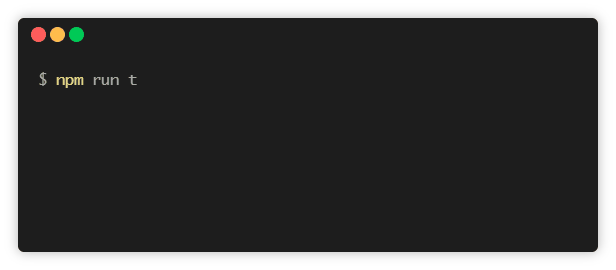

## Getting Started

Before diving in technical steps we highly recommend to check out the [Cucumber introduction](https://docs.cucumber.io/guides/overview) page.

### Step 1

First you need to have Nightwatch.js and Cucumber.js to be installed locally.

```bash
npm install --save-dev nightwatch cucumber
```

or shorter

```bash
npm i -D nightwatch cucumber
```

If you are new to Nightwatch.js you can read the [developer guide](http://nightwatchjs.org/guide).

### Step 2

Install `nightwatch-api`

```bash
$ npm i -D nightwatch-api
```

### Step 3

Install some WebDriver driver. In this example we are going to test using Google Chrome browser. So we are installing the ChromeDriver.

```bash
$ npm i -D chromedriver
```

### Step 4

In project root create a JavaScript configuration file for Nightwatch.js. Use `nightwatch.conf.js` instead of `nightwatch.json`. [More details](http://nightwatchjs.org/guide#settings-file) You don't need to specify `src_folders`.

```javascript
// nightwatch.conf.js

const chromedriver = require('chromedriver');

module.exports = {
  test_settings: {
    default: {
      webdriver: {
        start_process: true,
        server_path: chromedriver.path,
        port: 4444,
        cli_args: ['--port=4444']
      },
      desiredCapabilities: {
        browserName: 'chrome'
      }
    }
  }
};
```

### Step 5

Create a test setup file called `cucumber-setup.js`.

```javascript
// cucumber-setup.js

const { setDefaultTimeout, AfterAll, BeforeAll } = require('cucumber');
const { createSession, closeSession, startWebDriver, stopWebDriver } = require('nightwatch-api');

setDefaultTimeout(60000);

BeforeAll(async () => {
  await startWebDriver();
  await createSession();
});

AfterAll(async () => {
  await closeSession();
  await stopWebDriver();
});
```

### Step 6

Create a feature file under `features` folder.

```gherkin
## features/google.feature

Feature: Google Search

Scenario: Searching Google

  Given I open Google's search page
  Then the title is "Google"
  And the Google search form exists
```

### Step 7

Create a step definition file under `step-definitions` folder.

```javascript
// step_definitions/google.js

const { client } = require('nightwatch-api');
const { Given, Then, When } = require('cucumber');

Given(/^I open Google's search page$/, () => {
  return client.url('http://google.com').waitForElementVisible('body', 1000);
});

Then(/^the title is "([^"]*)"$/, title => {
  return client.assert.title(title);
});

Then(/^the Google search form exists$/, () => {
  return client.assert.visible('input[name="q"]');
});
```

### Step 8

Add an npm script to your `package.json`. This will make the test execution more convenient.
You can choose any name for it.

```json
// package.json
{
  ...
  "scripts": {
    "e2e-test": "cucumber-js --require cucumber-setup.js --require step-definitions",
    ...
  }
  ...
}
```

### Step 9

Run the tests by executing.

```bash
npm run e2e-test
```



For more examples check out the the [cucumber-example](https://github.com/mucsi96/nightwatch-api/tree/master/packages/cucumber-example)
or [cucumber-selenium-example](https://github.com/mucsi96/nightwatch-api/tree/master/packages/cucumber-selenium-example)
